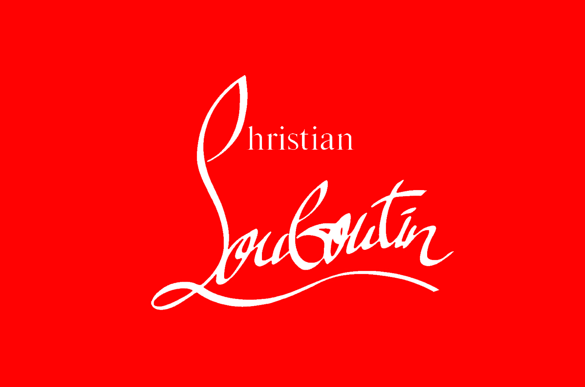

The red sole made Christian Louboutin’s shoes famous, and are worn by several celebrities such as Madonna, Victoria Beckham and the Kardashian sisters. The shoes are on the wish list of many, but unless you have between $400 and $6000 to spend on shoes, they will most likely just stay a dream.

They are elegant, flirtatious, expensive and fashionable. The red sole makes them stand out from other shoes, and even the average person can identify the shoes because of their statement soles.

> *“My assistant was sitting there, painting her nails red. I took one look and decided to color my soles red as a statement for the season, and my customers asked me not to stop.”* 

With such an iconic shoe also comes the need for a typography to reflect their brand. Along with shoes, Christian Louboutin makes handbags and other accessories, and their customers can identify the designer easily because of the typography used in their logo.

**Identifying the typography**

The “Louboutin” portion of the text has a curling handwritten font, where the top of the L curls up to make a C shape. This C is the beginning of the word Christian, however, the “hristian” portion is in a simple font with serifs.

**Why it’s a good typography for the brand**

The combination of the handwritten part and the writing with serifs convey both style and strength. The long “L” with the horizontal swirl makes the logo appear stable and strong which gives trust to the brand. At the same time gives the lack of symmetry the feeling of not being boring. The handwritten font gives a feeling of something handmade, which also will make the brand look exclusive and gives it a reason to be expensive. The handwritten part could also be seen as a signature and is supposed to simulate the signature of Christian Louboutin himself which again makes the brand feel more personal and exclusive.

Along with the handwritten font, the brand also uses a serif font. The use of serif fonts is frequently used in fashion because it is seen as an elegant typography. It is a font that has a history that dates back to the 18th century when stonemasons carved letters into rocks, and as we know, details were important in the old days, and we can see it in buildings and typography used. The history is exactly why serif fonts are seen as classic and refined. Along with being a classic elegant typography, Serif fonts also brings the feeling of confidence and trustworthy. All the characteristics mentioned above is what Louboutin is telling us with the logo that his brand is; classic, elegant, trustworthy and different.

Using the combination of the two different fonts makes Louboutin different from other fashion brands, and is, on the same level as the red soles, giving the brand a statement.

**References**

Biography. 2020. *Christian Louboutin*. \[online] Available at: <https://www.biography.com/fashion-designer/christian-louboutin?fbclid=IwAR3KHWWuQv6bUerdL6sIPJYfkJ2FV-CRSM_C2EuMaGvsv8YHw1PWBE9crEk> \[Accessed 30 September 2020].

O’Donnell, T., n.d. *Christian Louboutin Logo Design History And Evolution*. \[online] Logorealm.com. Available at: <http://logorealm.com/christian-louboutin-logo/> \[Accessed 30 September 2020].

Rinaldi, J., 2019. *Sans Serif Vs Serif Font: Which Should You Use & When?*. \[online] Impactbnd.com. Available at: <https://www.impactbnd.com/blog/sans-serif-vs-serif-font-which-should-you-use-when> \[Accessed 30 September 2020].