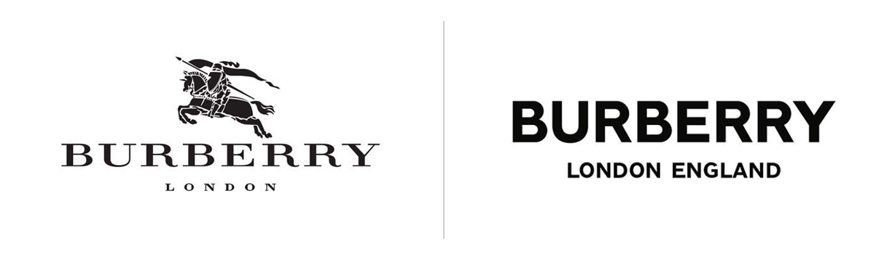
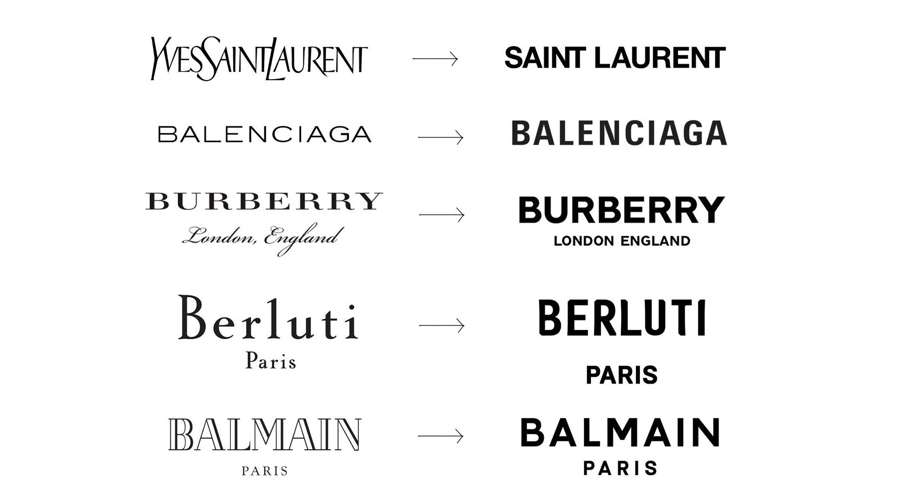

Established in 1856, Burberry has a history of providing polar explorers and the army in both first and second world war with trench coats. In 1901 Burberry got their first logo, the Equestrian Knight, which got the text “Burberry” added underneath it in 1999 with a recognizable serif font. People knew the brand based on the Equestrian Knight and the classic serif font. However, in 2018, the typography changed and the Equestrian Knight is taken away. Does the new typography really fit the brand?

I won’t write too much about the old typography, but let me mention a few things that is useful to know about serif fonts. I wrote in my [previous post](https://fashionable-letters.netlify.app/2020/09/28/a-typography-that-reflects-the-elegance-of-a-red-sole/) about Louboutin that typography with serifs are often use in fashion because it is seen as a classic and refined font. This is most likely why it was chosen as the typography in 1999. The big question is; why would an established fashion brand known for its classic typography change it?

Let us take a look at the new Burberry font. It is a sans serif font and it is bolder, and I would definitely describe it as minimalistic. While serif fonts convey tradition and history, sans serif fonts represent the opposite, they convey the feeling of being modern. The font also reflects a more approachable, youthful and relatable look.

Over the past few years, Burberry has not been the only established fashion designer who has changed their typography from serifs to sans serifs. Making them look very similar to each other.

Fashion is changing and so is its typography. It seems like designers want their brand to be seen as modern, more approachable and friendly, and by using sans serif fonts they are conveying that message.

So, to answer the question I asked in the beginning; does Burberry’s new typography reflects the brand?

In my opinion it really depends. If they are trying to change their brand to something that is a more friendly and relatable, then I would say yes. But, if they want to convey something classic, elegant, traditional and historic, I think their old typography would have represented them better.

#### References

burberry Corporate Website. n.d. *History - Burberry*. \[online] Available at: <https://www.burberryplc.com/en/company/history.html> \[Accessed 2 October 2020].

Rinaldi, J., 2019. *Sans Serif Vs Serif Font: Which Should You Use & When?*. \[online] Impactbnd.com. Available at: <https://www.impactbnd.com/blog/sans-serif-vs-serif-font-which-should-you-use-when> \[Accessed 30 September 2020].

Walker, R., 2018. *Why Fashion Brands All Use The Same Style Font*. \[online] Bloomberg.com. Available at: <https://www.bloomberg.com/news/articles/2018-11-20/why-fashion-brands-all-use-the-same-style-font-in-their-logos> \[Accessed 2 October 2020].