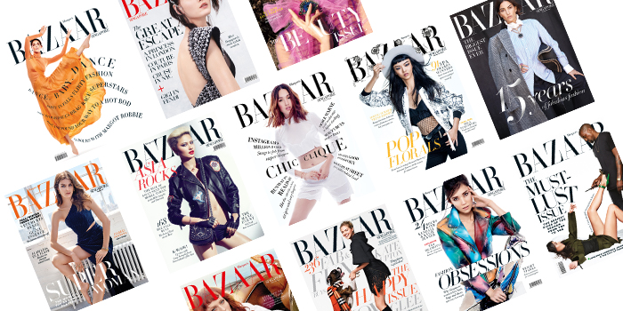

When going to a store to look for a magazine, the first thing you see is their amazing cover with a beautiful model and the name of the magazine. And, high-end magazines all have one thing in common – they love a beautiful serif font. It makes fashion titles look elegant, timeless and luxurious. The most popular typography used on fashion magazines is serif fonts such as Bodoni or Didot, more specifically, the **Didone.**

**So why is Didone used so much in relation to fashion?**

A very important aspects of Didone is the contrast between the thick and thin lines which is creating a sexy and elegant appearance. If we take a look through the lexicon of fashion brands, it confirms that the Didone aesthetic is shorthand for luxury, refinement and a certain posh attitude.

Two very famous fashion magazines using the Didone typography are Vogue and Harper’s Bazaar. Because of its radical thick-thin structure, words set in Didone fonts can be seen as a typographical veil over photography, which makes them particularly useful for magazine covers.

> **“We used Didot because it’s very feminine, not because of the magazine’s history. When we started at *Bazaar* things were very elegant and the direction of the magazine was about elegance.”** - Fabien Baron

The Didone style has never really gone out of style because it is pretty much synonymous with elegant and sophisticated type design. It is not only Vogue and Harper’s Bazaar using the fashionable typography. Along with major fashion magazines, luxury brands such as Cartier and Christian Dior use Didone typefaces for their logo.

The typeface is used in the major fashion magazines around the world, along with other luxurious fashion brands. It is seen as a luxurious and elegant type and can be described as the synonym of fashionable typography. **Does that make the Didone typeface the ultimate fashion typography?**

#### **References**

I Love Typography. n.d. *A Brief History Of Type*. \[online] Available at: <https://ilovetypography.com/2008/05/30/a-brief-history-of-type-part-4/> \[Accessed 12 October 2020].

Miller, A., Deberney, C. and Cassandre, A., 2007. *Through Thick And Thin: Fashion And Type*. \[online] Eyemagazine.com. Available at: <http://www.eyemagazine.com/feature/article/through-thick-and-think-fashion-and-type> \[Accessed 12 October 2020].

Penney, M., 2016. *Type In History: The Didones*. \[online] Sessions College. Available at: <https://www.sessions.edu/notes-on-design/type-in-history-the-didones/> \[Accessed 12 October 2020].

InDesign Skills. 2014. *The Best Fonts For Magazine Design*. \[online] Available at: <https://indesignskills.com/tutorials/best-magazine-fonts/> \[Accessed 12 October 2020].