A well-known, and established fashion magazine. Harper’s Bazaar is not only known for being one of the earliest established fashion magazines in the world, they are known for the iconic typeface they have used on their covers. But the Didot typeface has not been a part of the magazine since their start in 1867.

### **1867 – 1889**

Between this time period the covers of Harper’s Bazar (at that time only written with on ‘a’) were illustrated in a Victorian style called Art Nouveau, which was a seen as a decorative and feminine style. Its aesthetic is characterised by extreme decoration. This style was used because it was seen as feminine, and is also the overall style of the time period with clothing, paintings and interior.

### **1867**

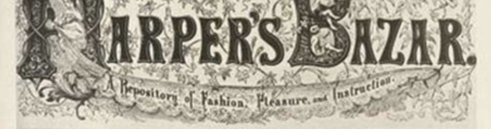

### **1894**

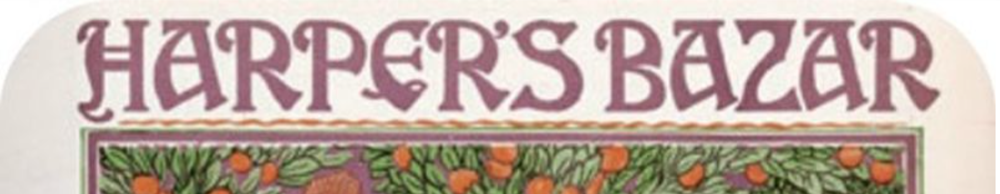

### **1899**

This style is still in the Art Nouveau period which we can see because of the decoration behind the text. The text in itself is less decorative because this is a time where the style was moving into a new era; Art Deco.

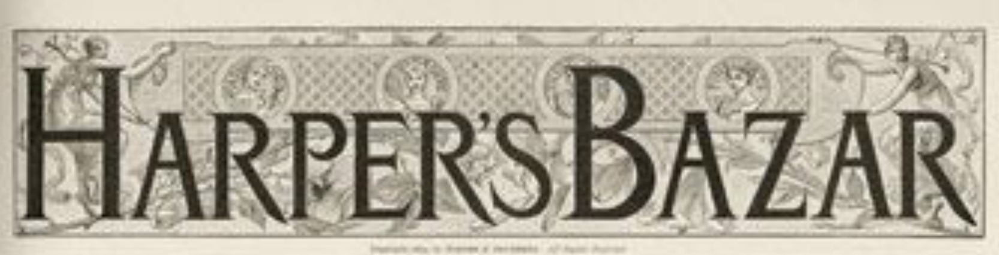

### **1915 – 1935/37**

Art Deco is not just a single style, but a collection of different and sometimes contradictory styles. This typographic style will always be seen as synonymous with the era which has been called the roaring 20s (think Gatsby) which was a time with upscale and carefree lifestyles, and also a time that brought a lot of positive change for females. Romain de Tirtoff, under the pseudonym Erte, designed over 200 covers for Harper’s Bazaar between 1915 – 1937. These covers represent how Art Deco and modernism rejected the past, and created new stylistic approaches and abandonment of form. This style worked well because it was a playful era where females had more freedom and rights.

### **1915**

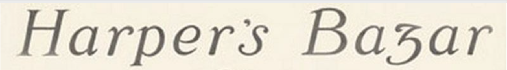

### **1930**

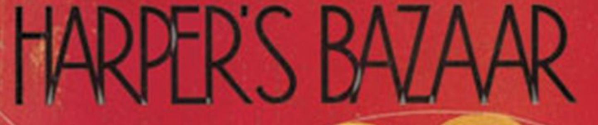

### **1935**

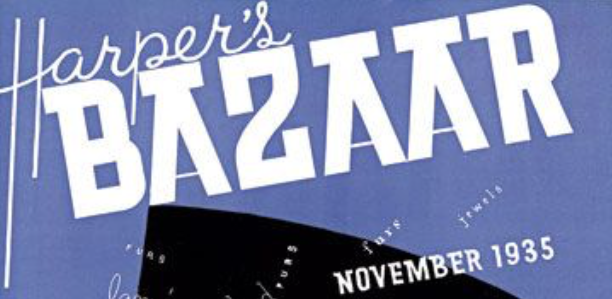

### **1940 – 1950’s**

After not having a set typography on their covers for several years was about to change. In 1934, the then editor Carmel Snow attended an art directors club of New York Exhibition, which was curated by Alexey Brodovitch. He was immediately offered the job as art director of Harper’s Bazaar, and it was under his reign the famous Didot typeface was adapted.

### **1940**

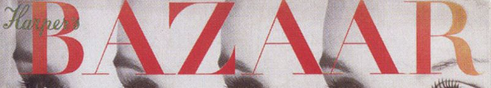

### **1942**

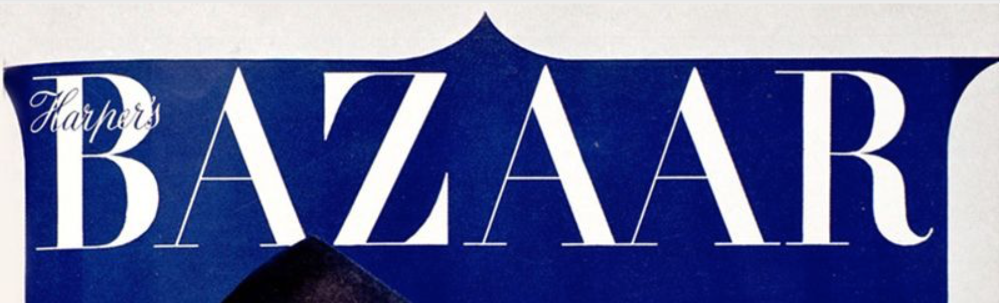

### **1947**

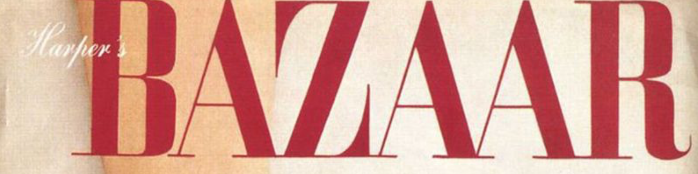

### **1950**

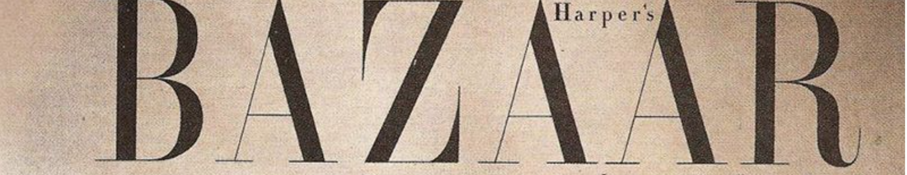

### **1999**

And then came Karen Betts, a young editor who within the first four months completely changed the logo from the well-known Didot typeface to this:

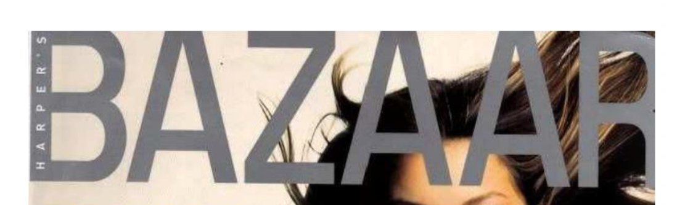

A very basic sans serif font. If I were to guess, I would say she tried to make the magazine look modern as that is often associated with sans serif. However, Harper’s Bazaar is a well-established, classic magazine known for its Didot typeface ([read this to learn about Didot](https://fashionable-letters.netlify.app/2020/10/10/didone-the-ultimate-fashion-typography/)). Betts was dismissed after a poor response on the change.

### **2020**

After the disaster in 1999, the magazine went back to their classic Didot typeface, and is to this day the same style, with only small alterations to it.

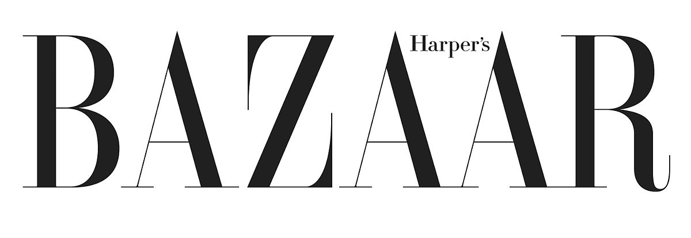

Glenda Bailey, editor of Harper’s Bazaar said:

> “It is Didot Caps, Didot Italics and also an introduction of Gotham”

#### ...

#### References

*150 Years Of Cover Design: Harper's Bazaar*. Anglia Ruskin University. Available at: <https://www.yumpu.com/en/document/read/58209836/150-years-of-cover-design-harpers-bazaar>

Penney, M., 2016. *Type History: Cassandre's Art Deco Type - Notes On Design*. \[online] Sessions College. Available at: <https://www.sessions.edu/notes-on-design/type-in-history-cassandres-art-deco-type/> \[Accessed 16 October 2020].

Strizver, I., n.d. *Art Nouveau Typestyles*. \[online] Fonts.com. Available at: <https://www.fonts.com/content/learning/fyti/typefaces/art-nouveau> \[Accessed 16 October 2020].

**Pictures:**

Harper's Bazaar Staff, 2017. *Vintage Harper's BAZAAR Through The Years*. \[online] Harper's BAZAAR. Available at: <https://www.harpersbazaar.com/fashion/photography/g57/vintage-harpers-bazaar-covers/?slide=39> \[Accessed 16 October 2020].