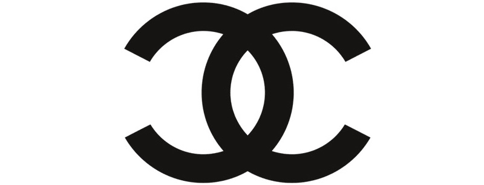

She has been described as a fashion icon ahead of her time. She was the first one to stop following fashion tendencies. Uncomfortable corsets, dull lacing, enormous hats and pretentious jewelry were long forgotten. Coco Chanel simply placed firm elegance against ever-changing fashion designs. Not only did she become famous for her designs, the typography has become just as famous as ‘the little black dress’.

> "In order to be irreplaceable one must always be different."  - Coco Chanel

Let us take a look at the logo first. It is made up of two interlaced Cs who are placed against each other. The logo has become the symbol of high fashion, and was designed by Coco Chanel herself. 

Along with designing the logo, the typeface used has also been made by Chanel herself. The type is today named “Chanel” and it is copyrighted.

One thing made Chanel’s typeface stand out from the other fashion designers: It is sans-serif, whereases serif fonts where used by almost everyone else as it is seen as very elegant. 

Sans-serif typography wasn’t seen as something elegant, and was not expected to be used by a high fashion brand. And if we take a look at the type, it is very strong, bold, simple and not what would normally be described as elegant. Yet, Chanel has made it one of the most elegant typefaces that is out there. 

> “Simplicity is the keynote of all true elegance.” – Coco Chanel

[In a previous blog post](https://fashionable-letters.netlify.app/2020/10/24/sans-serif-is-the-new-serif-is-that-right-burberry/), I wrote about how Burberry among other fashion brands have changed their iconic serif fonts to sans-serif. We are in a world that is becoming more and more technological, and nowadays most things can be found online. A sans-serif font is more legible, and is suited to a variety of media and work particularly well online, which probably is a reason why so many of the fashion brands have changed their typeface.

With this in mind, Chanel was obviously ahead of her time when it came to the typography. While she would not have known this when designing her logo and typeface, doing something different at that time, in 1925 to be exact, she made the typeface very relevant in todays fashion industry. 

...

#### References

Design, branding and business – Turbologo's blog. 2019. *History Of Chanel Logo – Font And Design*. \[online] Available at: <https://turbologo.com/articles/chanel-logo/?ref=Welcome.AI> \[Accessed 25 October 2020].

Miller, A., Cassandre, A. and Deberney, C., 2007. *Through Thick And Thin: Fashion And Type*. \[online] Eyemagazine.com. Available at: <http://www.eyemagazine.com/feature/article/through-thick-and-think-fashion-and-type> \[Accessed 25 October 2020].

WHELAN, J., 2019. *The Revolution Will Not Be Serifised: Why Every Luxury Brand’S Logo Looks The Same*. \[online] The Business of Fashion. Available at: <https://www.businessoffashion.com/articles/opinion/the-revolution-will-not-be-serifised-why-every-luxury-brands-logo-looks-the-same-burberry-balmain-balenciaga> \[Accessed 25 October 2020].