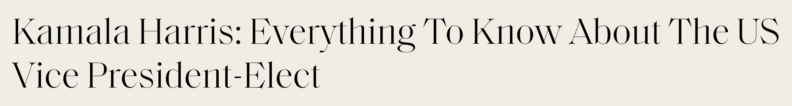
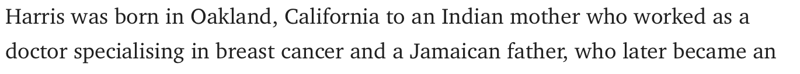
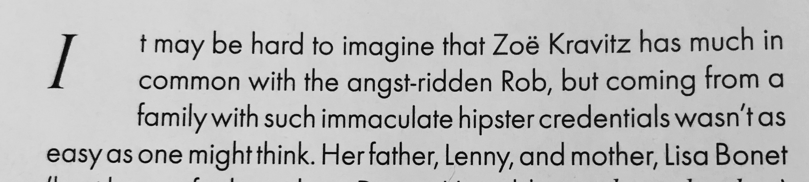
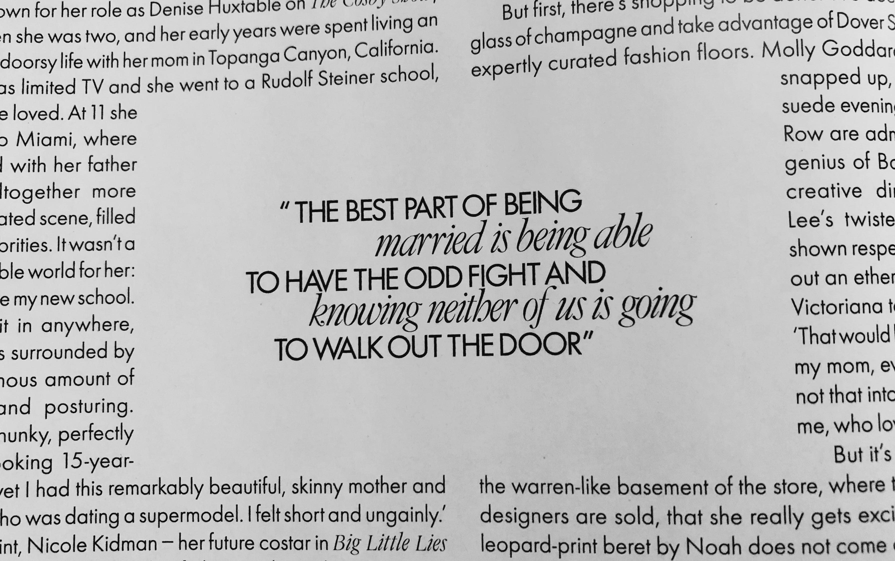

As I have looked at what kind of typography fashion magazines use to present themselves on their cover, I thought it was time for us to take a look on the inside – both online and print.

 

**ONLINE**

The font they have used for their headlines and subheadings is a version of the Didot. We can identify that it because of the contrast between thick and thin lines. This is as we know from previous, a very popular fashion font. It gives an elegant statement, as well as it fits the brand.

However, a Didot typeface is not ideal to use for the body text, as the contrast between the thick and thin lines can be challenging to read in smaller longer texts. Elle has here decided to use a simple serif font because it is easier and more comfortable to read. 

You can read the article I am using as my example [here](https://www.elle.com/uk/life-and-culture/a33581587/kamala-harris/).

**PRINT**

I was expecting Elle to be using the same font for body text in both print and online, but that was not the case. I the print magazine they have used a sans-serif font for the body text. 

While the composition of the text is more straight forward online, in the printed magazine we can find some more decorative ways they have used the typography. If we look at the picture above, we can see that they have used a drop cap, which is an effective way of grabbing readers attention because they add personality and visual strength to the page. 

Another page element they have in the printed magazine, an element that also brings visual power to the page, is the pull-quote. A pull-quote is often used to attract the reader and to break up long blocks of text.

In the quote they have used the combination of sans-serif and serif font. Combining the use of a sans-serif and serif font brings out the feeling of classic and fashionable, but also modern and approachable.

 This is from the interview of Zoe Kravitz in the March 2020 issue.

**THOUGHTS**

I have been reading up on typography used in magazines, especially the one used for the body text. What I found surprised me considering how Elle has decided to present their body text online vs print. As it turns out, Serifs are more commonly used in print while sans-serif is popular for online. Studies have found that serif fonts are easier to read because their serifs make each character more distinctive, which means the letters are easier to recognize quickly. However, because computer screens have lower resolutions than print, sans-serif fonts are recommended for online use. This is because the lower resolution can make small serif characters harder to read than the equivalent sans-serif characters.

 

There is no rule on what kind of fonts a magazine needs to use, the important thing is that it is not exhausting and hard to read it. As a frequent reader of Elle, both online and print, I have never thought about what font they use until I did research for this blog post. I guess that means their choice of typography is working.

**...**

### References

COUSINS, C., 2020. *Serif Vs. Sans Serif Fonts: Is One Really Better Than The Other?*. \[online] Designshack.net. Available at: <https://designshack.net/articles/typography/serif-vs-sans-serif-fonts-is-one-really-better-than-the-other/> \[Accessed 10 November 2020].

Magazine Designing. 2013. *Drop Caps And Initial Letters*. \[online] Available at: <https://www.magazinedesigning.com/drop-caps-and-initial-letters/> \[Accessed 10 November 2020].

Magazine Designing. 2013. *Pull-Quotes*. \[online] Available at: <https://www.magazinedesigning.com/pull-quotes/> \[Accessed 10 November 2020].

Scribe.com.au. n.d. *Serif And Sans-Serif Fonts*. \[online] Available at: <http://www.scribe.com.au/tip-w017.html> \[Accessed 10 November 2020].