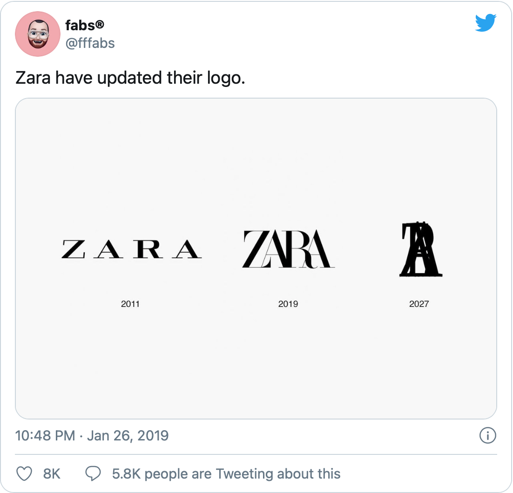

Zara’s goal is to provide high-class fashion to the everyday consumer, which translate to; we are more likely to afford Zara than Chanel. I have had a look at the typography used in their logo to see if it conveys their goal.

 The font used in the logo is *Linotype Didot Pro Bold,* which is designed by Adrian Frutiger. The Zara logo font has come to identify the company, and the black colour indicates its special style, elegance, and luxury. It is also a style we recognize from other high-class (expensive) fashion brands. 

The use of a Didot typeface makes the brand look fashionable because of its contrast between thin and thin lines. However, the little swirl on the ‘R’ is giving us a feeling of softness and friendliness. This is something that helps Zara appear more appealing for the everyday person who can’t afford Chanel and Dior. I personally also think the negative tracking is making the logo look friendly and gives a feeling of unity. 

 

The use of thick and thin lines, a little swirl on the ‘R’ and negative tracking, I would say the logo successfully convey their goal of high-class fashion to the everyday consumer. 

#### **However,**

Just like a lot of other fashion brands, Zara has also changed their logo. This has brought on criticism from typographers who has described the design as ‘claustrophobic’

> The German typographer Erik Spiekermann called it “*the worst piece of type \[he’s] seen in years”*

*The new design is made by Baron & Baron. The negative tracking used is not a part of the font, but rather a signature element the artistic director and Baron & Baron founder Fabien Baron is known for using.* 

*This is what they say about the new Zara logo:*

*“It’s high street made high fashion – an opportunity to introduce an artful new elevation to this bastion of democratic style. Baron & Baron’s partnership with Zara gives rise to an approach that blends elegance with edge – lifting the retailer to the level of luxury contemporaries, in a celebration of art and fashion for all.”*

*The new logo has also been made fun of on Twitter by Fabio Basile of British design studio fortnight. He mocked the logo with an image forecasting Zara’s logo in eight years if it were to follow the same pattern.*

The new logo has brought on mixed feelings, but regardless, the costumers identify the brand because of that logo.

**...**

##### **References**

Baron-baron.com. n.d. *Baron & Baron / Fashion / Zara*. \[online] Available at: <http://baron-baron.com/fashion/zara/> \[Accessed 15 November 2020].

Hitti, N., 2019. *Zara Logo Gets Controversial Revamp By Baron & Baron*. \[online] Dezeen. Available at: <https://www.dezeen.com/2019/02/04/zara-logo-controversial-rebrand-baron-baron/> \[Accessed 15 November 2020].

Quora. n.d. *What Font Is Used In Zara's New Logo?*. \[online] Available at: <https://www.quora.com/What-font-is-used-in-Zaras-new-logo> \[Accessed 15 November 2020].

Hyperpix. 2020. *Zara Font*. \[online] Available at: <https://hyperpix.net/fonts/zara-font/?fbclid=IwAR0IMcA1fNBGJtVhKpJO9FEun08k6_9J8pzly-8QXtAVbrVJdHAGcblSvb0> \[Accessed 15 November 2020].

FreeLogoServices Blog. 2019. *Zara Revealed A New Logo - And We Actually Like It*. \[online] Available at: <https://www.freelogoservices.com/blog/2019/01/30/zara-revealed-a-new-logo-and-we-actually-like-it/> \[Accessed 15 November 2020].