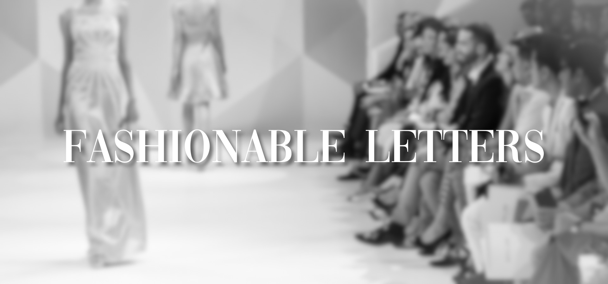
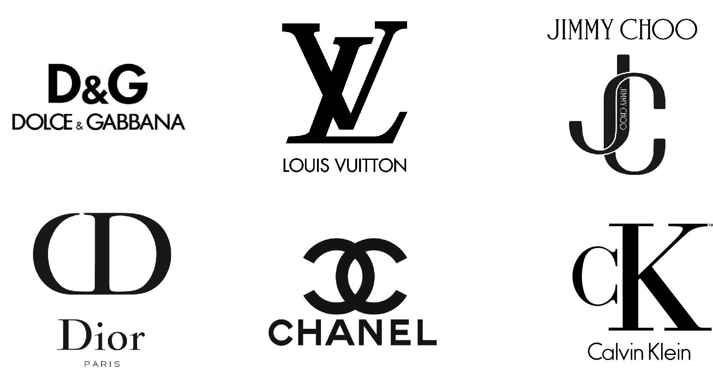
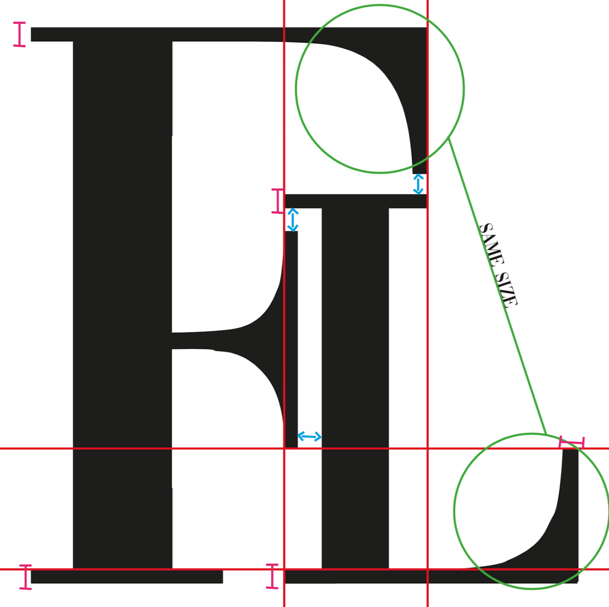

My name is Marie, and I am the girl behind this blog where I will explore the typography we can find in the wonderful world of fashion.

I am not a typical fashion girl, but I find the industry very interesting, which is why I have chosen it as the theme of this blog. I will look at typography used, among others, in fashion magazines and designer brands.

I have decided to present this blog in a simple and elegant way, using mostly black and white design. The typography I have decided to use myself is inspired by the fonts used in fashion. In my heading photo, I have used the same font they use on the cover of *Vogue.* Not only because it is featured on one of the world’s biggest fashion magazines, but because I personally really like it and I think it represents fashion. The serifs along with the mix of thick and thin lines, makes the typography look simple, but elegant. Also reflecting the saying ‘less is more’ which is often used in the fashion industry. Typography with serifs are frequently used in the fashion world, and I will in this blog take a look at why that is.

The picture behind the title is of a fashion runway, and by using that image you will have an understanding of what the theme of this blog is. I have decided to blur it out so that my title "Fashionable Letters" is in focus. I have chosen to use the colour white here to make it clean and the feeling of blending in with the picture. To make the text stand more out I have put a shadow on it, which also makes it easier to read, and the details in the typography are given more attention.

### My logo

When it comes to the logo, I have taken inspiration from several typographical fashion logos.

I have decided to keep my logo very simple with just two black letters representing “Fashionable Letters." Since I have taken inspiration from other fashion logos, I have decided to keep the same colour for the my “FL” logo, as they have used in theirs, which is the colour black (see picture above). While black can be associated with several things, some of them are: sophistication, trustworthy and success. I want my blog to convey the feeling of quality and trustworthy, and the use of black in my logo helps bring that out. I have used the same typography as in my heading photo to keep the theme. 

While it may look like just two black letters placed beside each other, it is carefully thought through which you can see in the illustration below.

