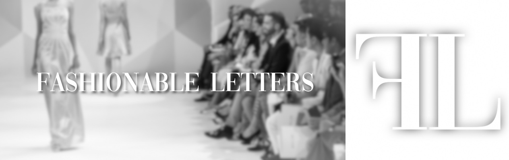

#### **About me**

My name is Marie, and I am currently a second-year student at Oxford Brookes University studying Media Journalism and publishing. I am from the wonderful country Norway (I am very proud of that fact). I like travelling and travel journalism is something I would very much like to explore. Along with travelling and exploring the world, I like being out in the nature, and would definitely describe myself as an adventurous girl.

#### **About this blog**

I am not a typical fashion girl, but I find the industry very interesting, which is why I have chosen it as the theme of this blog. More specific, I will look at the typography that represents the fashion world. This includes among others; fashion magazines, designer brands, and stores.

I have decided to present this blog in a simple and elegant way, using mostly black and white design. The typography I have decided to use myself are inspired by the fonts used in fashion. In my heading photo and logo, I have used the same font as they use on the cover of *Vogue.* Not only because it is featured on one of the world’s biggest fashion magazines, but because I personally really like it and think it represents fashion. The serifs along with the mix of thick and thin lines, makes the typography look simple, but elegant. Also reflecting the saying ‘less is more’ which is often used in the fashion industry.

When it comes to the logo, I have taken inspiration from the very famous Chanel logo which is composed with two opposite-facing and interlocking C’s. I have decided to keep to the same font as in my heading photo to keep the theme.

I am excited to learn more of the typography existing in the fashion world, and I hope you enjoy reading it as much as I will enjoy writing it!